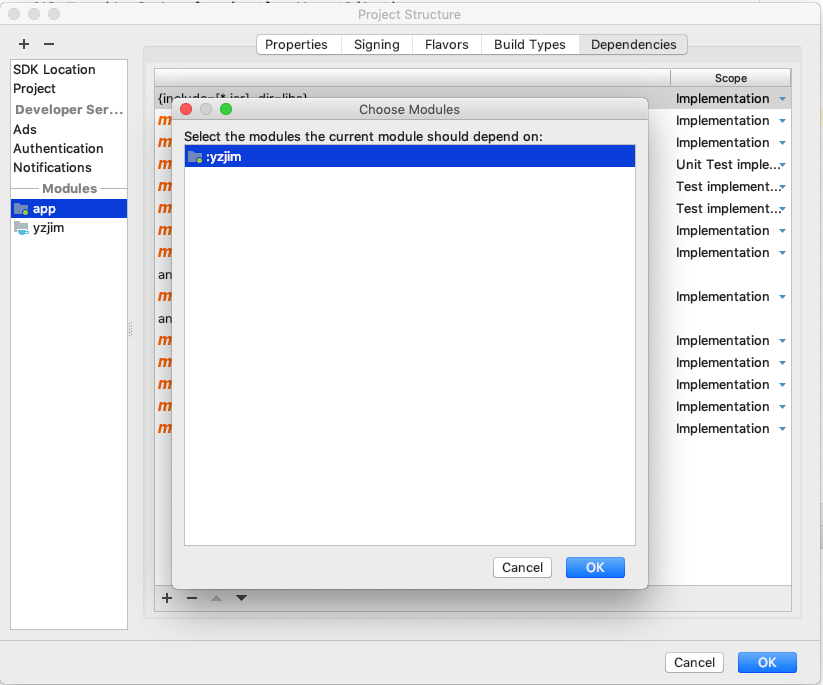

# Android客户端集成
#  {docsify-ignore}
--------------
# Android SDK介绍及导入

## Android SDK 介绍
  
## Android SDK 导入

### 导入SDK

下载云之家IM SDK的aar包，保存至您的本地路径，这里假设保存的文件名为yzjim.aar。

然后引入aar包，方法是，在AndroidStudio中新建工程或打开您现有的工程，点击File -> New Module -> Import .JAR/.AAR Package，在File Name一栏定位到并选择您下载的yzjim.aar文件，点击Finish完成引入。


此时在AndroidStudio的Project面板中，选择"Project"浏览模式，即可看到yzjim路径已被添加进项目工程

接下来，需要在工程根目录下的settings.gradle脚本中添加：
```java
include ':yzjim'
```
并进行一次sync

sync成功后，为app模块添加yzjim包依赖，方法是，在app模块上单击右键，选择Open Module Settings，然后选中Dependencies页签，点击左下角的加号，选择Module Dependency，然后即可看到yzjim，选择并确定。




添加好依赖后AndroidStudio会自动sync工程，如果没有自动sync则手动sync工程，完成导入。

### 第三方库依赖

完成导入后还需在app模块的build.gradle中配置imsdk所依赖的一些第三方库，添加如下配置代码即可，具体用途已通过注释标出：

```java
// 注解支持库，如@NonNull等注解
implementation 'com.android.support:support-annotations:28.0.0'

// Room是Android官方首选的SQLite集成库
implementation 'android.arch.persistence.room:runtime:1.1.1'
annotationProcessor 'android.arch.persistence.room:compiler:1.1.1'

// 安卓架构组件（Android Architecture Components），imsdk中利用这里的LiveData返回可观测的数据，以及ProcessLifeCycle实现前后台切换监听
implementation 'android.arch.lifecycle:extensions:1.1.1'
annotationProcessor 'android.arch.lifecycle:compiler:1.1.1'

// okhttp网络请求框架以及okhttp日志打印组件
implementation 'com.squareup.okhttp3:okhttp:3.9.0'
implementation 'com.squareup.okhttp3:logging-interceptor:3.8.1'

// stetho组件，用于通过Chrome的“chrome://inspect”功能调试app
implementation 'com.facebook.stetho:stetho:1.5.0'
implementation 'com.facebook.stetho:stetho-okhttp3:1.5.0'

// Google的JSON序列化和反序列化工具
implementation 'com.google.code.gson:gson:2.8.5'
```

其中的okhttp3:logging-interceptor 和 stetho 依赖为纯粹的调试用途组件，可以去除，目前imsdk处于内部测试阶段，暂未开放去除。

添加以上代码后，sync工程，完成依赖配置。

### 配置工程

#### 配置AndroidManifest.xml

imsdk中内置的AndroidManifest.xml中已声明了sdk需要的权限和组件，这些权限无需再次声明：

```xml
    <uses-permission android:name="android.permission.INTERNET" />
    <uses-permission android:name="android.permission.ACCESS_NETWORK_STATE" />
    <uses-permission android:name="android.permission.ACCESS_WIFI_STATE" />
    <uses-permission android:name="android.permission.WAKE_LOCK" />
```

这四个均为普通权限，不需要运行时动态申请。理论上imsdk核心功能不需要任何额外的权限，但为了实现IM的相关功能，您很可能需要声明以下权限：

```xml
    <uses-permission android:name="android.permission.VIBRATE" />
    <uses-permission android:name="android.permission.READ_PHONE_STATE" />
    <uses-permission android:name="android.permission.WRITE_EXTERNAL_STORAGE"/>
    <uses-permission android:name="android.permission.CAMERA" />
    <uses-permission android:name="android.permission.RECORD_AUDIO" />
    <uses-permission android:name="android.permission.RECORD_VIDEO" />
```

### APP打包混淆


--------------
# Android SDK基础功能

### 初始化SDK

在Application中配置appId、环境参数以及初始化代码

```java
public class MyApplication extends Application {

    private static final String IM_APP_ID = "1234567890";
    private static final String API_BASE_URL = "http://172.20.181.40:19060";
    private static final String FILE_BASE_URL = "http://172.20.181.40:10211";
    private static final String LONG_LINK_URL_LONG = "172.20.181.40:9210";
    private static final String LONG_LINK_URL_SHORT = "172.20.181.40:9211";

    @Override
    public void onCreate() {
        super.onCreate();

        if (isMainProcess()) {
            // IMSDK会创建一个子进程来维持长连接，所以初始化时需判断在主进程时才初始化

            // IM事件监听入口
            IMClient.IMEventListener imEventListener = new IMClient.IMEventListener() {
                @Override
                public void onPushNotificationMessage(YZJPushMessage pushMessage) {
                    //通知推送送达事件

                    NotificationCompat.Builder mBuilder = new NotificationCompat.Builder(sInstance, NOTIFICATION_CHANNEL_ID)
                            .setSmallIcon(R.drawable.notify_small_icon)
                            .setContentTitle("云之家IM新消息")
                            .setContentText(pushMessage.getContent())
                            .setPriority(NotificationCompat.PRIORITY_DEFAULT)
                            .setAutoCancel(true);

                    NotificationManagerCompat notificationManager = NotificationManagerCompat.from(sInstance);
                    notificationManager.notify(groupIdToInt(pushMessage.getGroupId()), mBuilder.build());
                }
            };

            // 调用IMClient.init方法，传入配置参数
            IMClient.init(this,
                    IM_APP_ID,
                    API_BASE_URL,
                    FILE_BASE_URL,
                    LONG_LINK_URL_LONG,
                    LONG_LINK_URL_SHORT,
                    imEventListener);
        }

        if (isImProcess()) {
            // IMSDK会创建一个子进程来维持长连接，需要在子进程中创建一个网络连接变化的广播接收器
            registerReceiver(new LongLinkManager.ConnectionReceiver(),
                    new IntentFilter(ConnectivityManager.CONNECTIVITY_ACTION));
        }
    }

    // ...省略其他代码（isMainProcess()和isImProcess()方法的实现见Demo源码）
}
```
IM_APP_ID：分配的唯一appid

API_BASE_URL：服务端接口地址

FILE_BASE_URL：文件服务接口地址

LONG_LINK_URL_LONG：长连接长连请求地址

LONG_LINK_URL_SHORT：长连接短连请求地址

### 登录
用户登录成功后，调用IMClient的login方法，使用服务端返回的token进行imsdk的登录，登录成功后才能发送和接收消息，登录成功后会得到服务端返回的在IM系统中该用户对应的用户id，调用时需确保登录调用是成功的（回调中带有是否成功的参数），并保存返回的userId至本地存储。

```java
/**
 * 利用token进行IMSDK的"登录"，只需在帐号登录成功后调用，callback中的result参数为该用户在IM体系中的userId，
 * 应用层应保存该值至本地SP，因为会有业务场景用到这个userId。需要注意，应用层需确保login回调成功。
 * @param token token
 * @param callback result参数为IM系统中的用户ID，
 */
public void login(final String token, final YZJCallback<String> callback)

```

### 退出登录
在用户退出登录时，调用IMClient的logout方法注销imsdk，这个方法会断开通讯连接，释放相关资源
```java
public void logout() 
```


--------------
# 群组（会话）

群组相关功能全部通过GroupManager对象进行调用，GroupManager为单例，获取方式为

```java
IMClient.getInstance().getGroupManager();
```

### 创建群组
```java
/**
 * @param groupName 群组名称
 * @param userIds 群成员列表，自己建的群一定包含自己作为成员（且默认为管理员），所以这里的list参数不需要包含自己的userId，
 * 如果包含也不会出错。如果仅传入自己的userId，则创建与自己的聊天。
 */
public void createGroup(String groupName, List<String> userIds, final YZJCallback<GroupOpResult> callback)
```  

### 获取本人全部群组
此方法返回LiveData类型，当数据变化时自动发出通知，例如当某个群有新消息时，无需再次拉取或查询，这个方法返回的对象会自动带上最新的群组列表，触发更新回调
```java
public LiveData<List<YZJGroup>> getGroupListLive()
```

### 从本地缓存中查找某一个群组
```java
public void getGroupFromCache(final String groupId, final YZJCacheCallback<YZJGroup> callback) 
```

### 从本地缓存中查找某一个群组，以LiveData返回

当该群组变更时，自动触发更新，例如通过此方法获取群组对象用来渲染群组名称，则任何一端修改了群组名，该对象将自动触发更新回调，并带有最新的数据

```java
/**
 * 从本地缓存中查询并返回对应的YZJGroup，以LiveData形式
 */
public LiveData<YZJGroup> getGroupLive(String groupId)
```

### 从本地缓存中删除一条记录
```java
public void deleteGroupFromDB(final String groupId)
```

### 设置草稿
```java
/**
 * 设置群组草稿
 * @param groupId 群组id
 * @param draft 群组草稿字符串，传入null或空字串则为清除草稿
 */
public void setDraft(final String groupId, final String draft)
```

### 判断单人群组是否已存在
```java
/**
 * 判断单人组是否已存在，一般来说，业务上不可能需要创建重复的单人组，所以在创建群组时，如果意图创建单人组时，
 * 先利用此方法进行判断是否已存在该单人组，注意与自己聊天也算是单人组
 * @param userId 单人聊天的对象用户id，可以是自己
 * @param callback 因为这是一次db查询，所以通过callback传回结果，注意并不会调用网络请求进行查询，如果传回值为空，则表示没有此单人群，否则表示已有此单人群
 */
public void isSingleGroupExist(final String userId, final YZJCacheCallback<YZJGroup> callback)
```  


--------------
# 消息

消息相关功能全部通过MessageManager对象进行调用，MessageManager为单例，获取方式为

```java
IMClient.getInstance().getMessageManager();
```


### 获取群组全部消息，以LiveData返回

排序为按消息发送时间升序，即最新的消息在最后面。当有新消息时，LiveData对象自动以最新的消息列表数据触发更新回调。Demo中聊天页面消息列表基于此方法实现，详见Demo源码。

```java
public LiveData<List<YZJMessage>> getGroupMessagesLive(final String groupId)
```

### 发送文本消息
```java
public void sendTextMessage(String groupId, String content)
```

### 发送带提及的文本消息
```java
public void sendTextMessageWithMentions(String groupId, String content, List<String> mentionIds)
```

### 转发消息
```java
/**
 * @param groupId 目标群组
 * @param content 转发的消息的内容
 * @param forwardPersonName 原消息（被转发的消息）的发送人名称
 * @param forwardGroupName 原消息（被转发的消息）所属群组的名称
 * @param forwardSendTime 原消息（被转发的消息）发送时间
 */
public void sendForwardTextMessage(String groupId, String content, String forwardPersonName, String forwardGroupName, String forwardSendTime) 
```

### 转发多媒体消息
```java
/**
 * 转发图片或视频消息，转发多媒体消息不支持携带来源信息，相当于发送一条完全一样的新信息
 * @param groupId 目标群组
 * @param srcMsg 原消息的YZJMessage对象
 */
public void sendForwardMultiMediaMessage(String groupId, YZJMessage srcMsg)
```

### 发送小视频消息
```java
/**
 * 发送小视频消息
 * @param groupId 目标群组id
 * @param videoFilePath 视频文件路径
 * @param videoThumbFilePath 视频预览图文件路径
 * @param duration 视频时长
 * @param previewPicWidth 视频预览图宽度（像素）
 * @param previewPicHeight 视频预览图高度（像素）
 */
public void sendVideoMessage(String groupId, final String videoFilePath, final String videoThumbFilePath, int duration, int previewPicWidth, int previewPicHeight)
```

### 发送语音消息
```java
/**
 * 发送语音消息
 * @param groupId 目标群组id
 * @param voiceFilePath 语音文件路径
 * @param duration 语音时长
 */
public void sendVoiceMessage(String groupId, final String voiceFilePath, int duration) 
```

### 发送图片消息
```java
/**
 * 发送图片消息
 * @param groupId 目标群组id
 * @param imageFilePath 图片文件路径
 * @param picWidth 图片宽度
 * @param picHeight 图片高度
 */
public void sendImageMessage(final String groupId, final String imageFilePath, int picWidth, int picHeight) 
```

### 发送内置动态表情消息
```java
/**
 * 发送内置表情
 * @param groupId 群组id
 * @param fileId 表情文件id（表情文档中可查询）
 * @param content 内容
 * @param name 表情名称
 * @param ext 表情文件扩展名
 * @param size 表情文件尺寸
 * @param picWidth 表情图片宽度
 * @param picHeight 表情图片高度
 */
public void sendExpression(String groupId, String fileId, String content, String name, String ext, int size, int picWidth, int picHeight)
```

### 清空群组聊天记录
```java
/**
 * 清空群组聊天记录
 * @param groupId 群组id
 * @param callback 回调
 */
public void clearGroupMsg(final String groupId, final YZJCallback<NullResult> callback)
```

### 设置群组已读
```java
/**
 * 设置群组已读
 *
 * @param groupId  群组Id
 * @param callback 回调
 */
public void setGroupRead(String groupId, final YZJCallback<NullResult> callback)
```

### 删除消息
```java
/**
 * 删除消息
 * @param msgs 待删除的消息列表
 * @param callback 回调
 */
public void deleteMsg(List<YZJMessage> msgs, final YZJCallback<NullResult> callback)
```

### 撤回消息
```java
/**
 * 撤回消息
 */
public void withdrawMsg(String groupId, String msgId, final YZJCallback<NullResult> callback)
```

### 获取消息未读详情
```java
/**
 * 获取消息已读未读详情，包括已读人员列表和未读人员列表
 */
public void getMessageUnreadDetail(String groupId, String messageId, final YZJCallback<MessageUnreadDetailResult> callback)
```

### 设置群组消息已读
```java
/**
 * 把group中的所有message都标记为已读，与setGroupRead不同之处在于setGroupRead仅设置group的未读数为0，
 * 不会改变message的未读状态，例如被提及的消息，setGroupRead不会把该消息标为已读，所以对方仍然看到是未读状态
 */
public void setGroupMessagesRead(final String groupId)
```

### 重发发送失败的消息
```java
/**
 * 重发发送失败的消息
 */
public void resendFailedMessage(YZJMessage failedMsg)
```


### 获取总未读数
```java
/**
 * 获取总未读消息数
 */
public void getMessageUnreadCount()
```


--------------
# 群组管理

群组相关功能全部通过GroupManager对象进行调用，GroupManager为单例，获取方式为

```java
IMClient.getInstance().getGroupManager();
```

### 修改群组名称
```java
public void updateGroupName(String groupName, String groupId, final YZJCallback<NullResult> callback)
```

### 群组加人
```java
public void addUsers(String groupId, List<String> userIds, final YZJCallback<GroupOpResult> callback)
```

### 群组删人
```java
public void deleteUsers(String groupId, List<String> userIds, final YZJCallback<GroupOpResult> callback)
```

### 退出群组
```java
public void quitGroup(String userId, final String groupId, final YZJCallback<GroupOpResult> callback)
```

### 解散群组
```java
public void dissolveGroup(final String groupId, final YZJCallback<GroupOpResult> callback) 
```

### 设置仅管理员添加群组成员
```java
/**
 * @param groupId 群组id
 * @param value 0-false，1-true
 */
public void setOnlyManagerCanAddMember(String groupId, int value, final YZJCallback<GroupStatusResult> callback)
```

### 设置仅管理员修改群组名称
```java
/**
 * @param groupId 群组id
 * @param value 0-false，1-true
 */
public void setOnlyManagerCanEditGroupName(String groupId, int value, final YZJCallback<GroupStatusResult> callback)
```

### 设置仅管理员可以at所有人
```java
/**
 * @param groupId 群组id
 * @param value 0-false，1-true
 */
public void setOnlyManagerCanAtAll(String groupId, int value, final YZJCallback<GroupStatusResult> callback)
```

### 设置是否开启退组发送系统消息
```java
/**
 * @param groupId 群组id
 * @param value 0-false，1-true
 */
public void setExitGroupSendMsg(String groupId, int value, final YZJCallback<GroupStatusResult> callback)
```

### 设置是否开启禁言
```java
/**
 * @param groupId 群组id
 * @param value 0-false，1-true
 */
public void setGroupBanned(String groupId, int value, final YZJCallback<GroupStatusResult> callback)
```

### 设置是否开启水印
```java
/**
 * @param groupId 群组id
 * @param value 0-false，1-true
 */
public void setGroupSafeMode(String groupId, int value, final YZJCallback<GroupStatusResult> callback)
```

### 设置是否重要群组
```java
/**
 * @param groupId 群组id
 * @param value 0-false，1-true
 */
public void setGroupFavorite(String groupId, int value, final YZJCallback<GroupStatusResult> callback)
```

### 设置是否置顶
```java
/**
 * @param groupId 群组id
 * @param value 0-false，1-true
 */
public void setGroupTop(String groupId, int value, final YZJCallback<GroupStatusResult> callback)
```

### 设置是否群组消息免打扰
```java
/**
 * @param groupId 群组id
 * @param value 0-false，1-true
 */
public void setGroupMsgNonDisturb(String groupId, int value, final YZJCallback<GroupStatusResult> callback)
```

### 添加管理员
```java
public void addGroupManager(String groupId, List<String> managerIds, final YZJCallback<GroupManagerResult> callback)
```

### 删除管理员
```java
public void deleteGroupManager(String groupId, List<String> managerIds, final YZJCallback<GroupManagerResult> callback)
```

--------------
# 第三方推送集成

--------------
# Demo介绍
--------------
