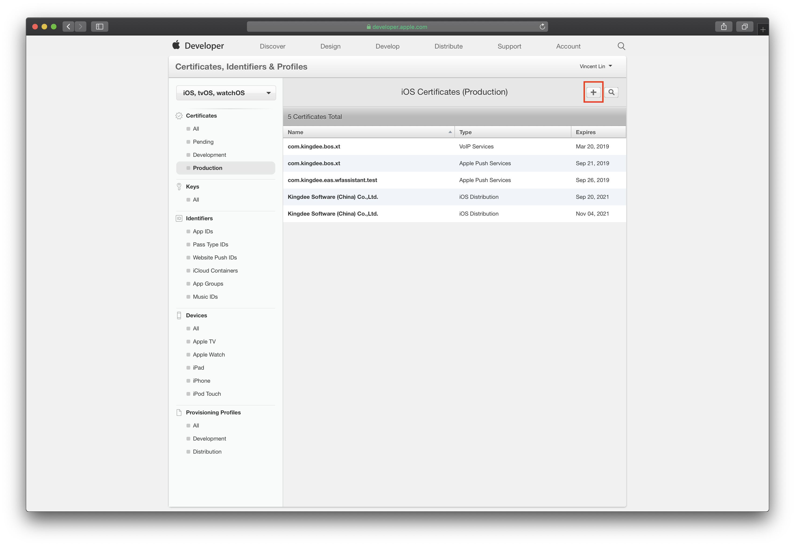
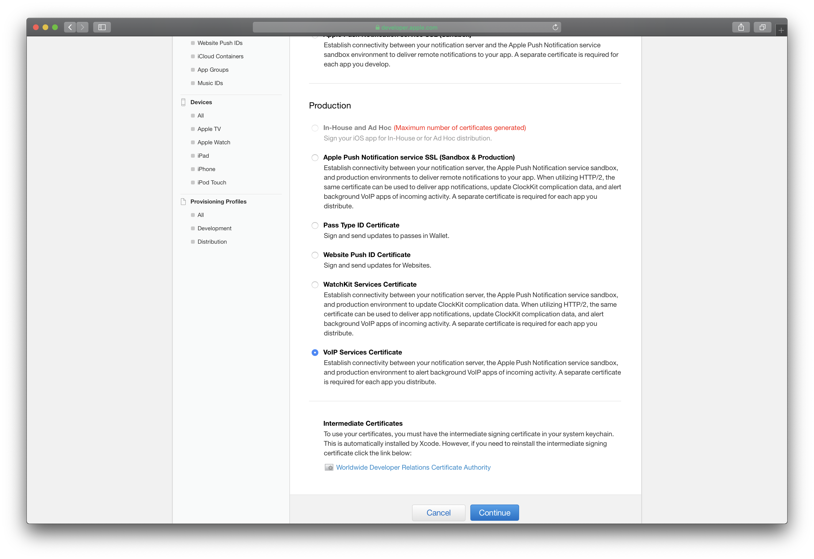
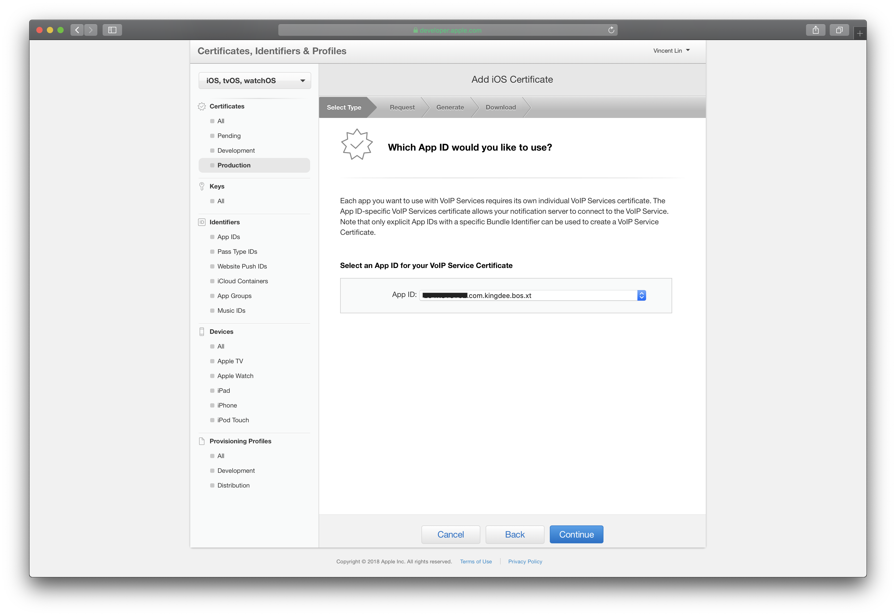
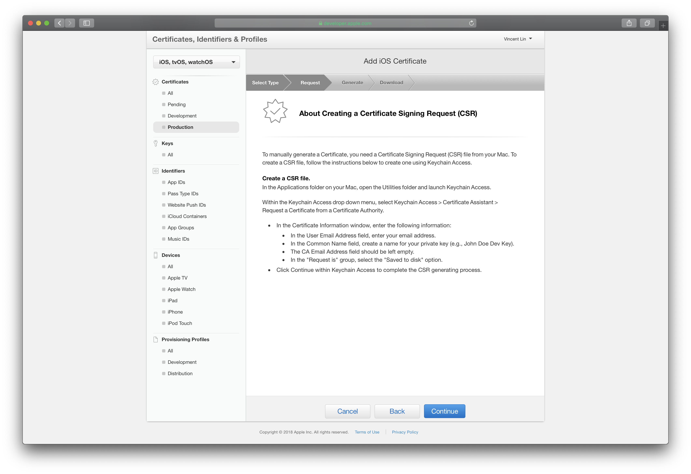
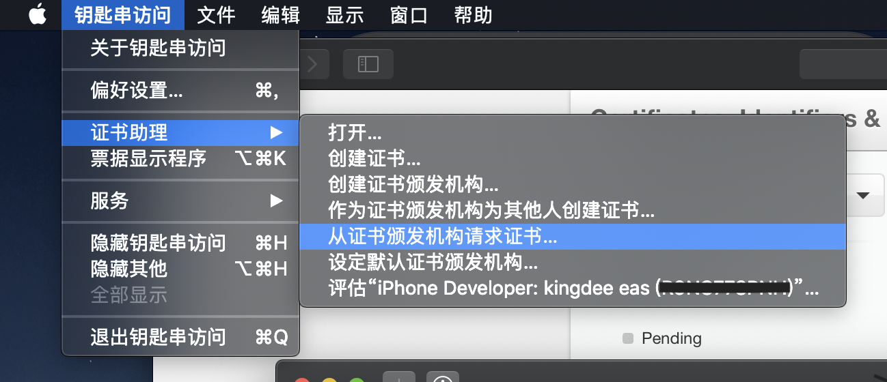
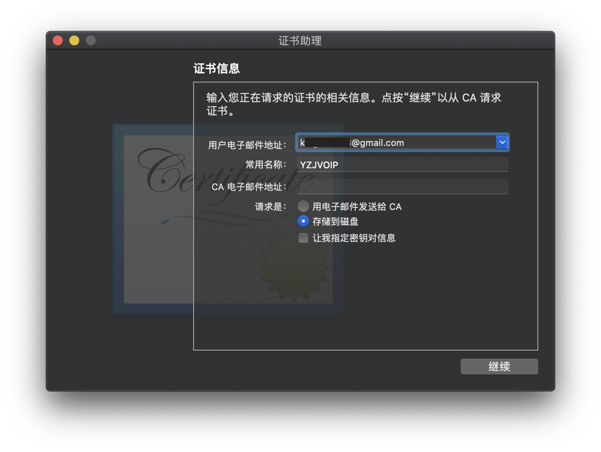
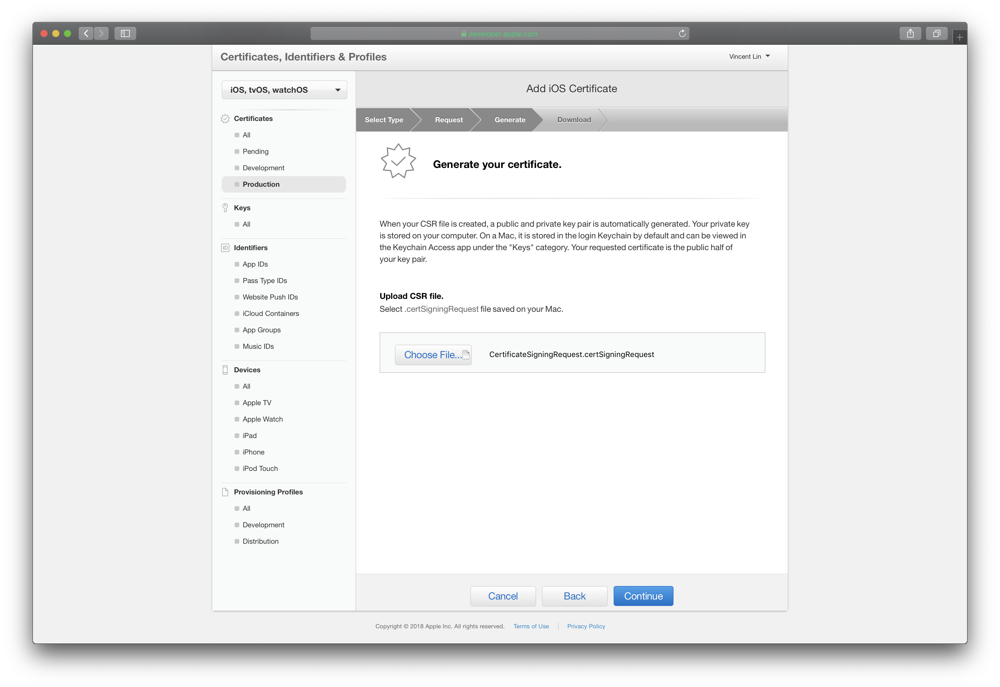
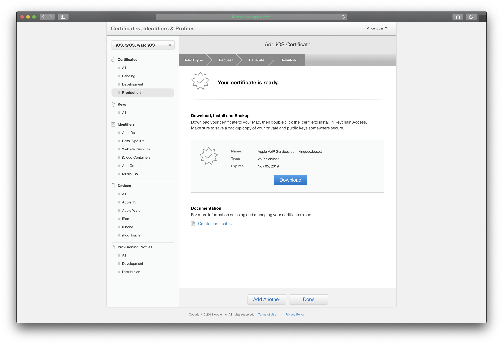
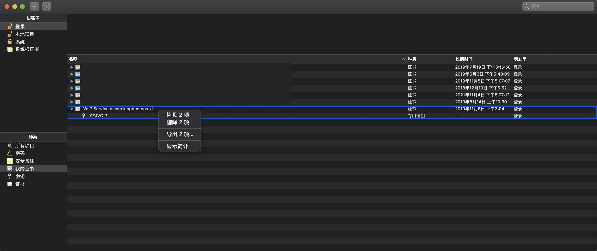
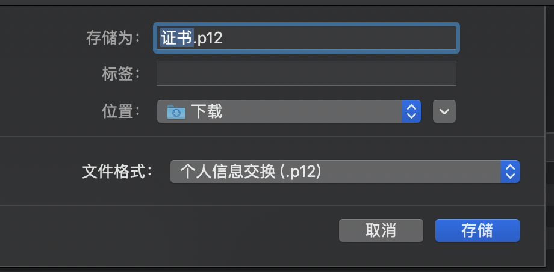

# 推送VOIP证书制作

进入苹果开发者网站[证书页面](https://developer.apple.com/account/ios/certificate/distribution),证书页面右上角，点击创建新的证书

选择 VoIP Services Certificate， 下一步

选择对应的APP ID

此时会提示在本地电脑上创建Certificate Request

打开应用程序中的“钥匙串访问”，从证书助理中选择“从证书颁发机构请求证书”

填入对应的信息，并选择存储到磁盘

本地会生成一个名为 CertificateSigningRequest.certSigningRequest 的文件，回到开始的网页，点击下一步，并选择刚刚生成的文件，下一步

此时已经生成好证书文件，下载到本地并双击安装这个.cer文件，之后钥匙串在“我的证书”选项中会多一个证书出来

展开我们生成的证书，同时选择证书和key，右键导出

选择.p12文件，此文件就是完整的证书文件，导出后提供给服务端备用

